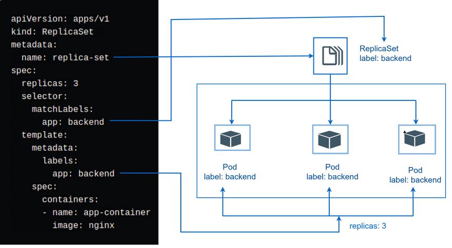
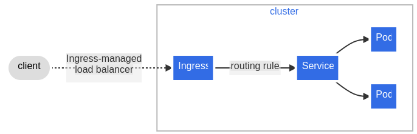

# Charla básica de Kubernetes

## *Introducción*

* *Contexto:* ¿Qué son los contenedores? ¿Cuáles son sus beneficios?

Los contenedores son unidades de software empaquetadas que encapsulan una aplicación y sus dependencias en un entorno aislado. Imaginalos como cajas portátiles que contienen todo lo que tu aplicación necesita para funcionar, incluyendo el código, las bibliotecas, las configuraciones e incluso un sistema operativo propio.

Beneficios de los contenedores:

    - Aislamiento: Cada contenedor se ejecuta en su propio espacio aislado, lo que significa que no puede interferir con otros contenedores o con el sistema host. Esto mejora la seguridad, la confiabilidad y la portabilidad de las aplicaciones.
    - Portabilidad: Los contenedores se pueden ejecutar en cualquier entorno que tenga un motor de contenedores compatible, como Docker o Kubernetes. Esto facilita la implementación de aplicaciones en diferentes entornos, como servidores locales, nubes públicas o híbridas.
    - Escalabilidad: Los contenedores se pueden escalar fácilmente para satisfacer las demandas cambiantes. Se pueden crear y destruir rápidamente nuevos contenedores para manejar picos de tráfico o cargas de trabajo crecientes.
    - Agilidad: Los contenedores permiten un desarrollo y una implementación más rápidos de las aplicaciones. Los desarrolladores pueden crear, probar e implementar nuevas versiones de las aplicaciones sin afectar a la versión de producción.
    - Eficiencia de recursos: Los contenedores comparten el kernel del sistema operativo, lo que reduce el uso de recursos y mejora la eficiencia general del sistema.

Algunos de estos beneficios cobran sentido cuando hacemos la comparacion entre contenedores y maquinas viertuales, que era lo que se usaba antes en su lugar.


Las máquinas virtuales (VM) y los contenedores son dos tecnologías de virtualización que permiten ejecutar aplicaciones en entornos aislados. Sin embargo, existen diferencias clave entre ambas:

Nivel de virtualización:

    Máquinas virtuales: Virtualizan todo el hardware de una computadora física, incluyendo la CPU, la memoria, el almacenamiento y los dispositivos de entrada/salida. Esto crea una computadora virtual completa que se ejecuta dentro de la computadora física host.
    Contenedores: Virtualizan solo el sistema operativo y las dependencias de la aplicación. Comparten el kernel del sistema operativo host, lo que los hace más livianos y eficientes que las VM.

Aislamiento:

    Máquinas virtuales: Ofrecen el más alto nivel de aislamiento, ya que cada VM tiene su propio sistema operativo y recursos de hardware. Esto las hace ideales para ejecutar aplicaciones que requieren un alto grado de seguridad o que son incompatibles entre sí.
    Contenedores: Brindan un aislamiento a nivel de sistema operativo, lo que significa que las aplicaciones que se ejecutan en contenedores no pueden interferir entre sí ni con el sistema host. Sin embargo, comparten el kernel del sistema operativo host, lo que puede generar algunas pequeñas vulnerabilidades de seguridad.

Portabilidad:

    Máquinas virtuales: Las VM son más difíciles de portar entre diferentes entornos, ya que dependen de la arquitectura de hardware subyacente.
    Contenedores: Los contenedores son altamente portables y se pueden ejecutar en cualquier entorno que tenga un motor de contenedores compatible, como Docker o Kubernetes. Esto los hace ideales para implementar aplicaciones en la nube o en entornos híbridos.

Eficiencia de recursos:

    Máquinas virtuales: Las VM consumen más recursos de hardware que los contenedores, ya que ejecutan un sistema operativo completo por sí mismas.
    Contenedores: Los contenedores son más eficientes en cuanto a recursos, ya que comparten el kernel del sistema operativo host y solo virtualizan las dependencias de la aplicación.

Casos de uso:

    Máquinas virtuales: Se utilizan idealmente para ejecutar sistemas operativos que no son compatibles con el sistema host, para ejecutar aplicaciones que requieren un alto nivel de seguridad o para probar software en un entorno aislado.
    Contenedores: Se utilizan idealmente para implementar aplicaciones modernas en microservicios, para implementar aplicaciones en la nube o en entornos híbridos, y para agilizar el desarrollo y la implementación de aplicaciones.


Si bien los contenedores ofrecen muchas ventajas, su gestión a gran escala puede ser compleja. Aquí es donde entran en juego Docker y Kubernetes.

    - Docker: Es una plataforma popular para crear, empaquetar y ejecutar contenedores. Proporciona una interfaz de usuario fácil de usar y una amplia gama de herramientas para administrar el ciclo de vida de los contenedores.

* *Contexto:* ¿Qué es Kubernetes? ¿Por qué es importante?

Kubernetes, también conocido como K8s, es una plataforma de código abierto para automatizar la implementación, administración y escalado de aplicaciones contenedorizadas.
Kubernetes facilita la automatización y la configuración declarativa, lo que es bueno porque leyendo lo que está en los manifiestos, sabemos lo que está desplegado.

Se encarga de las siguientes tareas:

    - Despliegue: Automatiza el proceso de implementación de tus aplicaciones contenedorizadas en un clúster de servidores.
    - Escalado: Aumenta o disminuye automáticamente el número de contenedores en ejecución en función de la demanda.
    - Gestión de estado: Mantiene el estado de tus aplicaciones contenedorizadas y las reinicia si fallan.
    - Auto-reparación: Detecta y reemplaza automáticamente los contenedores fallidos o defectuosos.
    - Balanceo de carga: Distribuye el tráfico de manera uniforme entre los contenedores en ejecución.
    - Descubrimiento de servicios: Permite que tus aplicaciones se encuentren y se comuniquen entre sí.
    - Seguridad: Implementa medidas de seguridad para proteger tus aplicaciones y clústeres.

¿Por qué es importante Kubernetes?

Kubernetes es importante por varias razones:

    - Facilita la implementación y administración de aplicaciones contenedorizadas: Kubernetes automatiza muchas de las tareas manuales y repetitivas que se asocian con la administración de contenedores, lo que te permite ahorrar tiempo y esfuerzo.
    - Mejora la escalabilidad y la confiabilidad de las aplicaciones: Kubernetes puede escalar automáticamente tus aplicaciones para satisfacer la demanda y reiniciar los contenedores fallidos, lo que garantiza que tus aplicaciones siempre estén disponibles y sean confiables.
    - Simplifica la gestión de entornos complejos: Kubernetes puede administrar clústeres de cientos o incluso miles de contenedores, lo que lo hace ideal para entornos de producción complejos.
    - Gestión eficiente de recursos: Kubernetes asigna automáticamente los recursos necesarios (CPU, memoria, almacenamiento) a cada contenedor según los límites y requisitos definidos, optimizando así el uso de recursos y evitando sobrecargas.
    - Portabilidad: Kubernetes proporciona una plataforma consistente y unificada para gestionar aplicaciones en múltiples entornos, ya sea en la nube pública, privada o entornos locales, facilitando la portabilidad de las aplicaciones y evitando la dependencia de proveedores específicos.

## *Estructura de kubernetes*


Un clúster de Kubernetes está compuesto por varios componentes que trabajan juntos para gestionar y ejecutar aplicaciones contenedorizadas de manera eficiente y escalable. Aquí están los componentes principales de un clúster de Kubernetes:

1. **Master Node (Nodo Maestro)**:

Los componentes que forman el plano de control toman decisiones globales sobre el clúster (por ejemplo, la planificación) y detectan y responden a eventos del clúster, como la creación de un nuevo pod cuando la propiedad replicas de un controlador de replicación no se cumple.

   - **kube-apiserver**: Es el punto de entrada para la API de Kubernetes. Gestiona las operaciones del clúster a través de la API RESTful, validando y configurando los datos antes de almacenarlos en etcd.
   - **etcd**: Almacena de manera persistente la configuración del clúster y los datos del estado del clúster.
   - **kube-scheduler**: Asigna automáticamente los pods recién creados a nodos en función de criterios como la carga de trabajo y las políticas de recursos.
   - **kube-controller-manager**: Controla los controladores que regulan el estado del clúster, como los nodos, los servicios y los pods.
   - **cloud-controller-manager**: cloud-controller-manager ejecuta controladores que interactúan con proveedores de la nube. 

2. **Worker Node (Nodo de Trabajo)**:
   - **kubelet**: Es el agente que se ejecuta en cada nodo y se encarga de asegurarse de que los contenedores estén en ejecución en los pods.
   - **kube-proxy**: Es un proxy de red que refleja el tráfico de red a los servicios de la aplicación en los pods individuales.
   - **Container Runtime**: Es el software responsable de ejecutar los contenedores, como Docker o containerd.

3. **Otros componentes opcionales**:
   - **DNS**: Un servicio que asigna nombres a las direcciones IP para facilitar la comunicación entre los pods.
   - **Dashboard**: Una interfaz web que permite la gestión y la monitorización del clúster de Kubernetes.
   - **Ingress Controller**: Gestiona el tráfico entrante del exterior del clúster hacia los servicios dentro del clúster.
   - **CNI (Container Network Interface)**: Define cómo los pods se comunican entre sí y con el mundo exterior.

## *API de Kubernetes*

La API de Kubernetes es la interfaz principal a través de la cual los usuarios, administradores y componentes de Kubernetes interactúan y gestionan el clúster de Kubernetes. Esta API está diseñada siguiendo principios RESTful (Representational State Transfer), lo que significa que utiliza los métodos HTTP estándar (GET, POST, PUT, DELETE, etc.) para realizar operaciones sobre recursos específicos del clúster.

Extensibilidad y Personalización:

Kubernetes permite a los usuarios y desarrolladores extender y personalizar la API mediante Custom Resource Definitions (CRDs) y API Extensions. Esto permite definir y gestionar recursos personalizados que van más allá de los recursos básicos proporcionados por Kubernetes, adaptando así la plataforma a necesidades específicas de aplicaciones y entornos.


kubectl es una herramienta de línea de comandos que actúa como cliente para interactuar con la API de Kubernetes. Es esencial para administrar y operar clústeres de Kubernetes de manera efectiva.

- Funcionalidades de kubectl:

    - **Acceso a la API**: kubectl permite a los usuarios enviar solicitudes HTTP a la API de Kubernetes de manera sencilla y desde la línea de comandos. Esto incluye la creación, actualización, obtención y eliminación de recursos en el clúster.

    - **Gestión de Recursos**: Con kubectl, puedes administrar una amplia gama de recursos de Kubernetes como pods, servicios, replicaset, deployments, namespaces, persistent volumes, entre otros.

    - **Interacción con Nodos**: kubectl facilita la gestión y supervisión de nodos en el clúster, permitiendo listar, inspeccionar y administrar el estado de los nodos.
    
    - **Gestión de Configuraciones**: kubectl permite administrar configuraciones complejas del clúster a través de archivos YAML o JSON, que definen recursos y sus relaciones.
    
    - **Diagnóstico y Depuración**: Facilita la obtención de registros (logs) de los pods, ejecución de comandos en contenedores específicos y proporciona herramientas para el diagnóstico de problemas.

## *Conceptos básicos de Kubernetes*

### **Nodos**:
Kubernetes ejecuta su carga de trabajo colocando contenedores en Pods para ejecutarlos en Nodos. Un nodo puede ser una máquina virtual o física, según el clúster. Cada nodo es administrado por el plano de control y contiene los servicios necesarios para ejecutar Pods.

### **Pods**:
Los pods son las unidades implementables más pequeñas que puede crear y administrar en Kubernetes.
Es un grupo de uno o más contenedores, con almacenamiento compartido y recursos de red, y una especificación sobre cómo ejecutar los contenedores. Los contenidos de un Pod siempre están ubicados y programados conjuntamente, y se ejecutan en un contexto compartido.


```yaml
apiVersion: v1
kind: Pod
metadata:
    name: nginx
spec:
    containers:
    - name: nginx
    image: nginx:1.14.2
    ports: # opcional
    - containerPort: 80
```

La mayoría de los recursos en Kubernetes comparten estos elementos fundamentales: apiVersion, kind, metadata y spec. Estos elementos son cruciales para definir la estructura, el comportamiento y la identificación de los objetos dentro de un clúster de Kubernetes.

Cada Pod está destinado a ejecutar una única instancia de una aplicación determinada. Si desea escalar su aplicación horizontalmente (para proporcionar más recursos generales ejecutando más instancias), debe usar varios Pods, uno para cada instancia. En Kubernetes, esto normalmente se denomina replicación.

    1. ¿Todos los recursos tienen estos elementos?
    
    Si bien estos elementos son comunes en la mayoría de los recursos, no todos los recursos los poseen de forma idéntica. Existen algunas excepciones:
    
        ConfigMaps y Secrets: En lugar de spec, estos recursos utilizan data para almacenar información en forma de clave-valor.
        ServiceAccounts: No tienen spec, solo apiVersion, kind, metadata y imagePullSecrets.
        ClusterRoles y ClusterRoleBindings: Poseen apiVersion, kind, metadata y rules para definir permisos a nivel de clúster.
        Nodes: No tienen spec, solo apiVersion, kind, metadata y status para describir el estado del nodo.
    
    2. Descripción detallada de cada elemento:
    
        - apiVersion (Versión de la API):
            - Descripción: Indica la versión de la API de Kubernetes que se utiliza para definir el recurso.
            - Importancia: Es fundamental para que Kubernetes interprete correctamente la estructura del recurso.
    
        - kind (Tipo de recurso):
            - Descripción: Define el tipo de objeto que se está creando, como Pod, Deployment, Service, etc.
            - Importancia: Permite a Kubernetes categorizar y gestionar el recurso de manera adecuada.
    
        - metadata (Metadatos):
            - Descripción: Proporciona información descriptiva sobre el recurso, como nombre, etiquetas y anotaciones.
            - Importancia: Permite identificar, organizar y buscar recursos de forma eficiente.
    
        - spec (Especificación):
            - Descripción: Define la configuración deseada para el recurso, incluyendo detalles como los contenedores a ejecutar, las redes a utilizar y los recursos necesarios.
            - Importancia: Determina el comportamiento y el estado del recurso una vez creado.
    
    3. Elementos adicionales dentro de cada sección:
    
        - apiVersion: Puede incluir un subnivel con el nombre del grupo de recursos (por ejemplo, apps/v1 para Deployments).
        - kind: Puede incluir un subnivel con el nombre singular del recurso (por ejemplo, Deployment o Service).
        - metadata:
            - name: Nombre único del recurso dentro del namespace.
            - labels: Etiquetas que permiten categorizar y filtrar recursos.
            - annotations: Información adicional para uso informativo o de herramientas.
        - spec: Varía significativamente según el tipo de recurso. Algunos ejemplos:
            - Pod: Contenedores, volúmenes, reinicio automático, recursos, etc.
            - Deployment: Número de réplicas, selector de pods, estrategia de actualización, etc.
            - Service: Tipo de servicio (ClusterIP, NodePort, LoadBalancer), selector de pods, puertos, etc.

    
### **Labels y seleccion**:

Las etiquetas (en inglés, labels) en Kubernetes son pares clave-valor que se asocian a objetos como Pods. Sirven para definir atributos identificativos de esos objetos, que sean significativos y relevantes para los usuarios, pero sin tener un significado específico para el sistema central de Kubernetes. Las etiquetas permiten organizar y seleccionar subconjuntos de objetos de forma eficiente.

**¿Cuándo usar etiquetas?**

* **Organización:** Agrupa objetos relacionados asignándoles la misma etiqueta. Por ejemplo, puedes etiquetar todos los Pods de una aplicación web específica con la clave "app" y el valor "mi-aplicacion-web".
* **Selección:** Filtra objetos basándote en sus etiquetas. Por ejemplo, puedes seleccionar todos los Pods con la etiqueta "app=mi-aplicacion-web" para realizar acciones específicas sobre ellos.

**¿Cómo funcionan las etiquetas?**

* Se pueden agregar etiquetas a los objetos durante su creación o modificarlas posteriormente.
* Cada objeto puede tener un conjunto de etiquetas clave-valor.
* Cada clave dentro de un objeto debe ser única.

**Ejemplo de uso:**

Imagina que tienes un cluster de Kubernetes con diferentes aplicaciones web desplegadas. Para una mejor organización y gestión, puedes etiquetar los Pods de cada aplicación:

```yaml
apiVersion: v1
kind: Pod
metadata:
  name: mi-pod-web1
  labels:
    app: aplicacion-web1  # Clave: app, Valor: aplicacion-web1
spec:
  # ... (otras definiciones del Pod)
```

En este ejemplo, el Pod `mi-pod-web1` tiene una etiqueta con la clave "app" y el valor "aplicacion-web1". De esta manera, puedes identificar y seleccionar fácilmente todos los Pods relacionados con esa aplicación web utilizando herramientas como `kubectl`.

**Diferencia con las anotaciones:**

Las [anotaciones](https://kubernetes.io/docs/concepts/overview/working-with-objects/annotations/) también son pares clave-valor que se pueden agregar a los objetos, pero se utilizan para almacenar información adicional que no es esencial para la identificación o selección de objetos. Por ejemplo, puedes usar anotaciones para almacenar notas, información de configuración o detalles de licencias.

Actualmente, la API admite dos tipos de selectores: basados ​​en igualdad y basados ​​en conjuntos . Un selector de etiquetas puede estar compuesto por varios requisitos separados por comas. En el caso de varios requisitos, se deben cumplir todos para que el separador de coma actúe como un operador lógico AND

- Requisito basado en la igualdad

```yaml
apiVersion: v1
kind: Pod
metadata:
  name: cuda-test
spec:
  containers:
    - name: cuda-test
      image: "registry.k8s.io/cuda-vector-add:v0.1"
      resources:
        limits:
          nvidia.com/gpu: 1
  nodeSelector:
    accelerator: nvidia-tesla-p100
```

- Requisito basado en conjuntos

``` yaml
apiVersion: apps/v1
kind: ReplicaSet
metadata:
  name: mi-replicaset
spec:
  replicas: 3
  selector:
    matchLabels:
      environment: in (production, qa)  # Pods en entornos "production" o "qa"
    matchExpressions:
      - key: tier
        operator: NotIn
        values: [ frontend, backend ]  # Excluye Pods con tier "frontend" o "backend"
  template:
    metadata:
      labels:
        environment: in (production, qa)
        tier: notin (frontend, backend)
    spec:
      containers:
      - name: mi-contenedor
        image: mi-imagen:ultima-version

```


### **Namespaces**

En Kubernetes, los espacios de nombres proporcionan un mecanismo para aislar grupos de recursos dentro de un único clúster. Los nombres de los recursos deben ser únicos dentro de un espacio de nombres, pero no entre espacios de nombres. El alcance basado en namespaces (espacios de nombres) se aplica únicamente a objetos dentro de un namespace (por ejemplo, Deployments, Servicios, etc.) y no a objetos con alcance a nivel de todo el cluster (por ejemplo, StorageClass, Nodos, PersistentVolumes, etc.).

¿Por qué usar namespaces?

    Aislamiento: Los namespaces evitan conflictos de nombres entre objetos de diferentes equipos o proyectos. Por ejemplo, si dos equipos tienen un Pod llamado "mi-pod", al colocarlos en namespaces diferentes, no hay ambigüedad.
    Organización: Agrupar objetos por namespaces facilita la gestión y la búsqueda de recursos específicos.
    Seguridad: Los namespaces pueden usarse para controlar el acceso a recursos, restringiendo quién puede ver, modificar o eliminar objetos dentro de un namespace específico.
    Multi-tenencia: Permite ejecutar múltiples aplicaciones o entornos aislados en un solo cluster, compartiendo la infraestructura de forma eficiente.

Conceptos clave:

    Default namespace: Cada cluster tiene un namespace por defecto llamado "default". Los objetos creados sin especificar un namespace se colocan automáticamente en "default".
    Custom namespaces: Puedes crear namespaces personalizados usando el comando kubectl create namespace.
    Selección de namespace: Para interactuar con objetos en un namespace específico, debes usar la bandera --namespace al ejecutar comandos de kubectl.
    Recursos limitados por namespace: Puedes establecer cuotas de recursos (CPU, memoria) para cada namespace, controlando el consumo de recursos por los objetos dentro de ese namespace.

Kubernetes inicia con cuatro namespaces por defecto:

    default: Es el namespace por defecto para los objetos que no especifican un namespace en particular. Es donde se crean los Pods, Services y Deployments por defecto si no se indica lo contrario.

    kube-system: Este namespace está reservado para los componentes del sistema Kubernetes, como el kube-proxy, el kube-scheduler y el kube-controller-manager. Los usuarios no deben crear objetos en este namespace.

    kube-public: Este namespace es especial y permite que algunos recursos (como Services) sean visibles para todos los usuarios, incluso aquellos que no están autenticados. Se utiliza principalmente para exponer recursos de infraestructura o servicios comunes.

    kube-node-lease: Este namespace contiene objetos Lease (arrendamientos) asociados con cada nodo del cluster. Los Leases se utilizan para garantizar que solo un Pod pueda acceder a un nodo específico en un momento dado.

### **ReplicaSet**

El propósito de un ReplicaSet es mantener un conjunto estable de réplicas de Pods ejecutándose en un momento dado. Como tal, a menudo se utiliza para garantizar la disponibilidad de una cantidad específica de Pods idénticos.

Un ReplicaSet en Kubernetes es como un molde para crear Pods. Funciona en tres pasos clave:

    Selección: Define cómo encontrar Pods que pueda administrar. Piensa en ello como una etiqueta que identifica a los Pods que pertenecen a este ReplicaSet.
    Número de réplicas: Indica cuántos Pods debe mantener en ejecución al mismo tiempo. Imagina que necesitas 3 copias de una aplicación, el ReplicaSet se asegura de tener siempre 3 Pods funcionando.
    Plantilla de Pod: Es la receta para crear nuevos Pods. Define los componentes (contenedores), recursos (memoria, CPU) y configuración de los Pods que se crearán.

El ReplicaSet trabaja constantemente para mantener el número deseado de Pods. Si un Pod falla o se elimina, el ReplicaSet crea uno nuevo a partir de su plantilla para reemplazarlo. De igual forma, si necesita más Pods para alcanzar el número deseado, utiliza la plantilla para crearlos.



Aunque puedes crear Pods simples sin problemas, se recomienda encarecidamente asegurarse de que dichos Pods no tienen etiquetas que puedan coincidir con el selector de alguno de tus ReplicaSets. La razón de esta recomendación es que un ReplicaSet no se limita a poseer los Pods especificados en su plantilla, sino que puede adquirir otros Pods.


### **Deployments**

Un Deployment en Kubernetes es como un asistente para actualizar tus Pods y ReplicaSets de forma controlada. Funciona así:

    Tú describes el estado deseado: Le dices al Deployment cuántos Pods quieres ejecutar y cómo deben estar configurados (piensa en ello como una receta).
    El Deployment se encarga del cambio: El Deployment Controller, un programa interno de Kubernetes, compara el estado actual de tus Pods con el estado deseado que definiste. Luego, realiza los cambios necesarios de forma gradual para alcanzar ese estado ideal.
    Flexibilidad para crear o reemplazar: Puedes usar Deployments para crear nuevos ReplicaSets con la configuración deseada, o incluso para reemplazar Deployments antiguos y adoptar todos sus recursos (como Pods existentes) en el nuevo Deployment.

Casos de uso típicos para Deployments

Los Deployments en Kubernetes ofrecen una forma controlada y automatizada de implementar y actualizar tus aplicaciones. A continuación, se detallan algunos casos de uso habituales:

    Implementar un ReplicaSet con un Deployment: Crea un Deployment para implementar un ReplicaSet. El ReplicaSet se encarga de crear Pods en segundo plano. Una vez finalizado, puedes verificar el estado del despliegue para ver si se realizó correctamente.

    Actualizar el estado de los Pods: Define el nuevo estado deseado para tus Pods modificando la sección PodTemplateSpec del Deployment. Esto provocará la creación de un nuevo ReplicaSet. El Deployment gestiona el proceso de migrar los Pods del ReplicaSet anterior al nuevo de forma controlada. Cada ReplicaSet nuevo actualiza la revisión del Deployment.

    Revertir a una versión anterior: Si la versión actual del Deployment presenta problemas, puedes realizar un rollback para volver a una revisión anterior. Al hacer un rollback, se crea un nuevo ReplicaSet basado en la revisión anterior y se migran los Pods del ReplicaSet actual al anterior. De esta forma, vuelves a la versión anterior de tu aplicación de forma controlada. Cada rollback también actualiza la revisión del Deployment.

    Escalar el Deployment: A medida que aumenta la carga de trabajo, puedes escalar el Deployment para crear más Pods y distribuir la carga.

    Pausar y reanudar el despliegue: Puedes pausar el despliegue de un Deployment para aplicar varias correcciones a su PodTemplateSpec. Una vez finalizadas las correcciones, puedes reanudarlo para iniciar un nuevo despliegue con la configuración actualizada.

    Monitorear el estado del Deployment: El estado del Deployment te indica si el proceso de implementación se está ejecutando correctamente o si se ha estancado.

    Limpiar ReplicaSets antiguos: Una vez que ya no necesites los ReplicaSets anteriores, puedes limpiarlos para liberar recursos en tu cluster de Kubernetes.

    Rollout (despliegue):
        Se refiere al proceso de implementar una nueva versión de tu aplicación en el cluster de Kubernetes utilizando un Deployment.
        Esto implica crear un nuevo ReplicaSet con la configuración deseada y migrar gradualmente los Pods del ReplicaSet anterior al nuevo.
        El Deployment controla la velocidad de esta migración para garantizar una transición sin problemas y minimizar el tiempo de inactividad de la aplicación.

    Rollback (retroceso):
        Significa revertir a una versión anterior de tu aplicación en el cluster de Kubernetes.
        Se utiliza cuando la nueva versión del Deployment presenta problemas o no funciona como se esperaba.
        Un rollback implica que el Deployment crea un nuevo ReplicaSet basado en la revisión anterior (una especie de copia de seguridad) y migra los Pods del ReplicaSet actual al anterior.
        De esta forma, vuelves a la versión anterior de tu aplicación de forma controlada.


### **StatefulSets**

Un StatefulSet es el objeto de la API workload que se usa para gestionar aplicaciones con estado.

Al igual que un Deployment, un StatefulSet gestiona Pods que se basan en una especificación idéntica de contenedor. A diferencia de un Deployment, un StatefulSet mantiene una identidad asociada a sus Pods. Estos pods se crean a partir de la misma especificación, pero no pueden intercambiarse; cada uno tiene su propio identificador persistente que mantiene a lo largo de cualquier re-programación.

Los StatefulSets son valiosos para aquellas aplicaciones que necesitan uno o más de los siguientes:

    - Identificadores de red estables, únicos.
    - Almacenamiento estable, persistente.
    - Despliegue y escalado ordenado, controlado.
    - Actualizaciones en línea ordenadas, automatizadas.

De los de arriba, estable es sinónimo de persistencia entre (re)programaciones de Pods. Si una aplicación no necesita ningún identificador estable o despliegue, eliminación, o escalado ordenado, deberías desplegar tu aplicación con un controlador que proporcione un conjunto de réplicas sin estado, como un Deployment o un ReplicaSet, ya que están mejor preparados para tus necesidades sin estado.


### **DaemonSet**

Un DaemonSet garantiza que todos (o algunos) de los nodos ejecuten una copia de un Pod. Conforme se añade más nodos al clúster, nuevos Pods son añadidos a los mismos. Conforme se elimina nodos del clúster, dichos Pods se destruyen. Al eliminar un DaemonSet se limpian todos los Pods que han sido creados.

Algunos casos de uso típicos de un DaemonSet son:

    - Ejecutar un proceso de almacenamiento en el clúster.
    - Ejecutar un proceso de recolección de logs en cada nodo.
    - Ejecutar un proceso de monitorización de nodos en cada nodo.

### **Service**

Un Servicio es un método para exponer una aplicación de red.

En Kubernetes, los servicios actúan como abstracciones de alto nivel que permiten a los pods descubrirse y comunicarse entre sí, incluso si se implementan en diferentes nodos o se reinician con frecuencia. Esto facilita el desarrollo, la implementación y la administración de aplicaciones distribuidas en contenedores.

Aquí es donde entran en juego los servicios:

    - Abstracción de la dirección IP: Un servicio crea una "dirección IP virtual" estable y fácil de recordar para tu conjunto de pods. Esta dirección no cambia, incluso si los pods individuales fallan o se reprograman.
    - Balanceo de carga: Los servicios distribuyen el tráfico de forma automática entre los pods disponibles en tu conjunto. Esto garantiza que las solicitudes de los clientes se manejen de manera eficiente, incluso si algunos pods no están disponibles temporalmente.
    - Descubrimiento de servicios: Los servicios permiten que los pods se descubran entre sí utilizando nombres de dominio DNS. Esto facilita la comunicación entre pods sin necesidad de conocer sus direcciones IP individuales.

Beneficios de los servicios de Kubernetes:

    - Simplificación del desarrollo: No necesitas modificar tu código para que funcione con Kubernetes. Los servicios manejan el descubrimiento y la comunicación entre pods de forma transparente.
    - Mayor resiliencia: Las aplicaciones son más resistentes a fallas de pods o nodos, ya que los servicios garantizan que el tráfico se redirija a los pods disponibles.
    - Fácil escalabilidad: Puedes escalar tus aplicaciones horizontalmente agregando o eliminando pods sin necesidad de modificar la configuración de los servicios.
    - Flexibilidad: Los servicios admiten diferentes tipos de tráfico, como HTTP, TCP y UDP.


Si su carga de trabajo habla HTTP, puede optar por utilizar un Ingress para controlar cómo el tráfico web llega a esa carga de trabajo. El ingreso no es un tipo de servicio, pero actúa como punto de entrada para su clúster. Un Ingress le permite consolidar sus reglas de enrutamiento en un único recurso, de modo que pueda exponer múltiples componentes de su carga de trabajo, ejecutándose por separado en su clúster, detrás de un único oyente.

Ingress expone rutas HTTP y HTTPS desde fuera del clúster a servicios dentro del clúster. El enrutamiento del tráfico se controla mediante reglas definidas en el recurso Ingress.



Debe tener un controlador de Ingress para satisfacer un Ingress. La creación de un recurso de Ingress no tiene ningún efecto.
A diferencia de otros tipos de controladores que se ejecutan como parte del binario kube-controller-manager, los controladores Ingress no se inician automáticamente con un clúster.

```yml
apiVersion: networking.k8s.io/v1 # Esta línea indica la versión de la API que se utiliza para definir el recurso. En este caso, es la versión "v1" del grupo "networking.k8s.io".
kind: Ingress
metadata:
  name: minimal-ingress # Define el nombre del recurso Ingress. En este caso, se llama "minimal-ingress"
  annotations: # (opcional)
    nginx.ingress.kubernetes.io/rewrite-target: / # Anotacion específica para el controlador Ingress Nginx. Reescribe la ruta de destino para todas las solicitudes a "/".
spec:
  ingressClassName: nginx-example
  rules:
  - http:
      paths: # Esta sección define las rutas que coinciden con esta regla.
      - path: /testpath
        pathType: Prefix # Indica que la ruta "/testpath" se considera un prefijo. Cualquier ruta que comience con "/testpath" coincidirá con esta regla (por ejemplo, "/testpath/data", "/testpath/info").
        backend: # Esta sección define el servicio al que se debe reenviar el tráfico que coincide con esta regla.
          service:
            name: test
            port:
              number: 80
```


Se puede configurar un Ingress para brindar a los Servicios URL a las que se pueda acceder externamente, equilibrar la carga del tráfico, finalizar SSL/TLS y ofrecer alojamiento virtual basado en nombres. Un controlador de Ingress es responsable de cumplir con el Ingress, generalmente con un balanceador de carga.

Supongamos que tiene un conjunto de Pods, cada uno de los cuales escucha en el puerto TCP 9376 y está etiquetado como app.kubernetes.io/name=MyApp. Puede definir un Servicio para publicar ese oyente TCP:

```yml
apiVersion: networking.k8s.io/v1
kind: Ingress
metadata:
  name: minimal-ingress
  annotations:
    nginx.ingress.kubernetes.io/rewrite-target: /
spec:
  ingressClassName: nginx-example
  rules:
  - http:
      paths:
      - path: /testpath
        pathType: Prefix
        backend:
          service:
            name: test
            port:
              number: 80
```

La aplicación de este manifiesto crea un nuevo servicio denominado "mi-servicio" con el tipo de servicio predeterminado ClusterIP. El Servicio apunta al puerto TCP 9376 en cualquier Pod con la etiqueta app.kubernetes.io/name: MyApp.

Tipos de servicios en Kubernetes

En algunas partes de tu aplicación (por ejemplo, los frontales) es posible que desees exponer un servicio en una dirección IP externa, accesible desde fuera de tu clúster.

Los tipos de servicios de Kubernetes te permiten especificar qué tipo de servicio deseas.

Los valores de tipo disponibles y sus comportamientos son:

ClusterIP:

Expone el servicio en una IP interna del clúster. Elegir este valor hace que el servicio solo sea accesible desde dentro del clúster. Este es el valor predeterminado que se utiliza si no especificas explícitamente un tipo para un servicio. Puedes exponer el servicio a la red pública de internet usando un Ingress o un Gateway.

NodePort:

Expone el servicio en la IP de cada nodo en un puerto estático (el NodePort). Para que el NodePort esté disponible, Kubernetes configura una dirección IP de clúster, igual que si hubieras solicitado un servicio de tipo ClusterIP.

LoadBalancer:

Expone el servicio externamente mediante un balanceador de carga externo. Kubernetes no ofrece directamente un componente de balanceo de carga; debes proporcionarlo tú mismo o integrar tu clúster de Kubernetes con un proveedor de nube.

ExternalName:

Mapea el servicio al contenido del campo externalName (por ejemplo, al nombre de host api.foo.bar.example). El mapeo configura el servidor DNS de tu clúster para que devuelva un registro CNAME con ese valor de nombre de host externo. No se configura ningún tipo de proxy.

El campo type en la API de Service está diseñado como una funcionalidad anidada: cada nivel se suma al anterior. Sin embargo, hay una excepción a este diseño anidado. Puedes definir un servicio LoadBalancer deshabilitando la asignación de NodePort del balanceador de carga.

La API Gateway para Kubernetes ofrece capacidades adicionales más allá de Ingress y Service. Puede agregar Gateway a su clúster: es una familia de API de extensión, implementadas mediante Definiciones de recursos personalizados (CRD)- y luego utilícelos para configurar el acceso a los servicios de red que se ejecutan en su clúster.


### **ConfigMaps**

Los ConfigMaps son objetos API de Kubernetes que almacenan datos no confidenciales en pares clave-valor. Se utilizan para separar la configuración de las imágenes de contenedor, lo que facilita la administración y la actualización de la configuración sin necesidad de reconstruir las imágenes. Los Pods y otros objetos de Kubernetes pueden consumir los datos almacenados en ConfigMaps de diversas maneras.

    - Almacenamiento de datos no confidenciales: Los ConfigMaps son ideales para almacenar datos de configuración que no son sensibles, como cadenas de conexión a bases de datos, URL de servicios externos o variables de entorno.
    - Separación de la configuración: Al separar la configuración de las imágenes de contenedor, los desarrolladores pueden modificar la configuración sin necesidad de volver a implementar las aplicaciones.
    - Inyección de configuración: Los Pods pueden consumir los datos de ConfigMaps como variables de entorno, argumentos de línea de comandos o archivos montados en volúmenes.
    - Flexibilidad de formato: Los datos de ConfigMaps pueden almacenarse en formato de cadena simple o como archivos codificados en Base64.
    - Gestión sencilla: Los ConfigMaps se crean, actualizan y eliminan utilizando la herramienta de línea de comandos kubectl o la API de Kubernetes.

Ejemplo:
Almacenar variables de entorno:

```yaml
---
apiVersion: v1
kind: ConfigMap
metadata:
  name: mi-configmap
data:
  DB_HOST: "db.example.com"
  DB_USER: "usuario"
  DB_PASSWORD: "password"
```

Uso en el Pod:

```yml
---
apiVersion: v1
kind: Pod
metadata:
  name: mi-pod
spec:
  containers:
  - name: mi-contenedor
    image: mi-imagen
    env:
    - name: DB_HOST
      valueFrom:
        configMapKeyRef:
          name: mi-configmap
          key: DB_HOST
    - name: DB_USER
      valueFrom:
        configMapKeyRef:
          name: mi-configmap
          key: DB_USER
    - name: DB_PASSWORD
      valueFrom:
        configMapKeyRef:
          name: mi-configmap
          key: DB_PASSWORD
```

A diferencia de la mayoría de los objetos de Kubernetes que tienen un spec, un ConfigMap tiene los campos data y binaryData . Estos campos aceptan pares clave-valor como sus valores. Tanto el campo data como el binaryData son opcionales. El campo data está diseñado para contener cadenas UTF-8 mientras que el campo binaryData está diseñado para contener datos binarios como cadenas codificadas en base64.

### **Secrets**

Los Secrets son objetos API de Kubernetes que almacenan información confidencial, como contraseñas, tokens de autenticación y claves de API. Permiten proteger datos sensibles y evitar que se expongan accidentalmente en logs, código o scripts. Los Secrets se almacenan encriptados en el servidor de Kubernetes y solo se pueden acceder a ellos de manera segura dentro de los Pods utilizando mecanismos específicos.

    - Almacenamiento seguro de información confidencial: Los Secrets protegen datos sensibles como contraseñas, tokens de autenticación y claves API, evitando su exposición accidental.
    - Encriptación: Los Secrets se almacenan encriptados en el servidor de Kubernetes utilizando el algoritmo AES-256, lo que garantiza su seguridad.
    - Acceso controlado: Los Secrets solo se pueden acceder a ellos desde Pods a través de mecanismos específicos, como variables de entorno o archivos montados en volúmenes.
    - Gestión sencilla: Los Secrets se crean, actualizan y eliminan utilizando la herramienta de línea de comandos kubectl o la API de Kubernetes.
    - Integración con otros componentes: Los Secrets se pueden usar con otros componentes de Kubernetes, como Deployments, Services y Ingress, para inyectar información confidencial de forma segura.

Ejemplo de Objeto Secret:

```yaml
---
apiVersion: v1
kind: Secret
metadata:
  name: db-password
type: Opaque
data:
  password: <base64-encoded-password>
```

Ejemplo de uso:

```yaml
apiVersion: v1
kind: Pod
metadata:
  name: mi-pod
spec:
  containers:
  - name: mi-contenedor
    image: mi-imagen
    env:
    - name: DB_PASSWORD
      valueFrom:
        secretKeyRef:
          name: db-password
          key: password
```

Tipos de Secretos:

Opaque:

    Este es el tipo de Secret genérico en Kubernetes y se utiliza para almacenar datos arbitrarios. Puedes guardar cualquier tipo de datos sensibles o información que necesites proteger, como contraseñas, tokens, o cualquier otro tipo de datos.

Service Account Token:

    Este tipo de Secret almacena el token de cuenta de servicio asociado a un ServiceAccount en Kubernetes. Los ServiceAccounts se utilizan para definir la identidad de los Pods y permitirles acceder a los recursos del clúster de Kubernetes de manera segura.

Docker Registry Credentials:

    Hay dos tipos de Secrets para almacenar credenciales de registro de Docker:
        docker-registry: Se utiliza para autenticarse en un registro de Docker privado. Debes proporcionar un username, password, email y server para configurarlo.
        docker-config: Este tipo de Secret almacena un archivo .docker/config.json serializado que contiene múltiples configuraciones de registro de Docker.

TLS Secrets:

    Este tipo de Secret se utiliza para almacenar certificados TLS (Transport Layer Security) y claves privadas que se necesitan para configurar conexiones TLS seguras. Pueden ser utilizados por servicios dentro de Kubernetes que requieren comunicaciones seguras.

SSH Secrets:

    Este tipo de Secret almacena datos de autenticación SSH, como claves privadas y públicas, que se utilizan para la autenticación SSH desde los Pods. Es útil cuando se necesita acceso seguro a sistemas externos utilizando SSH.

Basic Authentication:

    Este tipo de Secret se utiliza para almacenar credenciales de autenticación básica, como un username y password. Es útil cuando se necesita autenticar contra servicios que requieren este tipo de autenticación.

Token Secrets:

    Este tipo de Secret se utiliza para almacenar tokens de acceso u otros tokens sensibles que se necesitan para autenticar a los usuarios o servicios dentro del clúster de Kubernetes.

### **Volumenes**

Los volúmenes en Kubernetes son una abstracción crucial para manejar el almacenamiento de datos de manera eficiente y flexible dentro de los Pods.

Definición y Uso:
    Un volumen en Kubernetes es una unidad de almacenamiento que puede ser montada en uno o varios contenedores dentro de un Pod. Permite que los contenedores accedan y persistan datos más allá del ciclo de vida de un contenedor individual.

Tipos de Volumen:

    Kubernetes soporta una variedad de tipos de volúmenes que permiten diferentes estrategias de almacenamiento:
        - emptyDir: Un volumen temporal que se crea cuando un Pod es asignado a un nodo y se borra cuando el Pod es eliminado.
        - hostPath: Monta un directorio o archivo del sistema de archivos del nodo host en el contenedor.
        - PersistentVolume (PV) y PersistentVolumeClaim (PVC): Abstracciones para el almacenamiento persistente que permiten a los Pods acceder a almacenamiento persistente de manera independiente de los detalles de la infraestructura subyacente.
        - ConfigMap y Secret: Permiten montar datos de ConfigMaps o Secrets como archivos o variables de entorno en un contenedor.
        - NFS: Permite montar sistemas de archivos NFS en los contenedores.

Alcance y Duración:

    Los volúmenes están definidos a nivel de Pod y existen durante la vida útil del Pod. Esto significa que los volúmenes pueden ser compartidos por múltiples contenedores dentro de un mismo Pod y persisten mientras el Pod esté en ejecución.

Montaje y Configuración:

    Los volúmenes se especifican en la definición del Pod en el campo volumes, donde se configuran los tipos y propiedades del volumen. Cada contenedor en el Pod puede montar uno o varios volúmenes especificados en la sección volumeMounts dentro de su configuración.

Compartición de Datos:

    Los volúmenes permiten compartir datos entre contenedores en un Pod. Esto es útil para situaciones donde múltiples contenedores necesitan acceder a los mismos datos o compartir información de configuración.

Flexibilidad y Escalabilidad:

    Kubernetes ofrece una gran flexibilidad para gestionar volúmenes, permitiendo a los administradores de clústeres configurar y escalar el almacenamiento de datos de acuerdo a las necesidades específicas de las aplicaciones y los servicios desplegados.

Gestión de Ciclo de Vida:

    Kubernetes maneja automáticamente el ciclo de vida de los volúmenes, asegurándose de que los volúmenes persistentes estén disponibles para los Pods según sea necesario y se limpien correctamente cuando ya no sean necesarios.


* *Documentación oficial de Kubernetes:* [https://kubernetes.io/](https://kubernetes.io/)
* *Tutoriales y cursos de Kubernetes:* [https://kubernetes.io/docs/tutorials/](https://kubernetes.io/docs/tutorials/)
