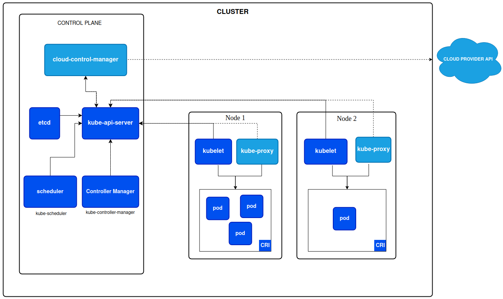
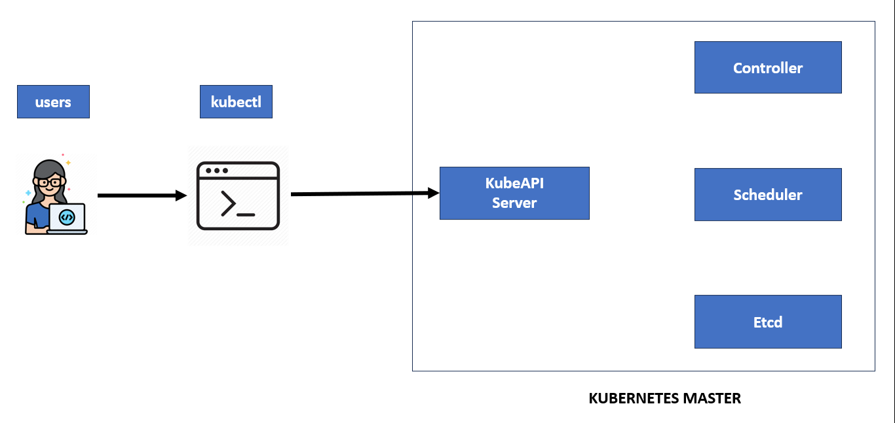

# Charla básica de Kubernetes

## *Introducción*

* *Contexto:* ¿Qué son los contenedores? ¿Cuáles son sus beneficios?

Los contenedores son unidades de software empaquetadas que encapsulan una aplicación y sus dependencias en un entorno aislado. Imaginalos como cajas portátiles que contienen todo lo que tu aplicación necesita para funcionar, incluyendo el código, las bibliotecas, las configuraciones e incluso un sistema operativo propio.

Beneficios de los contenedores:

    - Aislamiento: Cada contenedor se ejecuta en su propio espacio aislado, lo que significa que no puede interferir con otros contenedores o con el sistema host. Esto mejora la seguridad, la confiabilidad y la portabilidad de las aplicaciones.
    - Portabilidad: Los contenedores se pueden ejecutar en cualquier entorno que tenga un motor de contenedores compatible, como Docker o Kubernetes. Esto facilita la implementación de aplicaciones en diferentes entornos, como servidores locales, nubes públicas o híbridas.
    - Escalabilidad: Los contenedores se pueden escalar fácilmente para satisfacer las demandas cambiantes. Se pueden crear y destruir rápidamente nuevos contenedores para manejar picos de tráfico o cargas de trabajo crecientes.
    - Agilidad: Los contenedores permiten un desarrollo y una implementación más rápidos de las aplicaciones. Los desarrolladores pueden crear, probar e implementar nuevas versiones de las aplicaciones sin afectar a la versión de producción.
    - Eficiencia de recursos: Los contenedores comparten el kernel del sistema operativo, lo que reduce el uso de recursos y mejora la eficiencia general del sistema.

Algunos de estos beneficios cobran sentido cuando hacemos la comparacion entre contenedores y maquinas viertuales, que era lo que se usaba antes en su lugar.


Las máquinas virtuales (VM) y los contenedores son dos tecnologías de virtualización que permiten ejecutar aplicaciones en entornos aislados. Sin embargo, existen diferencias clave entre ambas:

Nivel de virtualización:

    Máquinas virtuales: Virtualizan todo el hardware de una computadora física, incluyendo la CPU, la memoria, el almacenamiento y los dispositivos de entrada/salida. Esto crea una computadora virtual completa que se ejecuta dentro de la computadora física host.
    Contenedores: Virtualizan solo el sistema operativo y las dependencias de la aplicación. Comparten el kernel del sistema operativo host, lo que los hace más livianos y eficientes que las VM.

Aislamiento:

    Máquinas virtuales: Ofrecen el más alto nivel de aislamiento, ya que cada VM tiene su propio sistema operativo y recursos de hardware. Esto las hace ideales para ejecutar aplicaciones que requieren un alto grado de seguridad o que son incompatibles entre sí.
    Contenedores: Brindan un aislamiento a nivel de sistema operativo, lo que significa que las aplicaciones que se ejecutan en contenedores no pueden interferir entre sí ni con el sistema host. Sin embargo, comparten el kernel del sistema operativo host, lo que puede generar algunas pequeñas vulnerabilidades de seguridad.

Portabilidad:

    Máquinas virtuales: Las VM son más difíciles de portar entre diferentes entornos, ya que dependen de la arquitectura de hardware subyacente.
    Contenedores: Los contenedores son altamente portables y se pueden ejecutar en cualquier entorno que tenga un motor de contenedores compatible, como Docker o Kubernetes. Esto los hace ideales para implementar aplicaciones en la nube o en entornos híbridos.

Eficiencia de recursos:

    Máquinas virtuales: Las VM consumen más recursos de hardware que los contenedores, ya que ejecutan un sistema operativo completo por sí mismas.
    Contenedores: Los contenedores son más eficientes en cuanto a recursos, ya que comparten el kernel del sistema operativo host y solo virtualizan las dependencias de la aplicación.

Casos de uso:

    Máquinas virtuales: Se utilizan idealmente para ejecutar sistemas operativos que no son compatibles con el sistema host, para ejecutar aplicaciones que requieren un alto nivel de seguridad o para probar software en un entorno aislado.
    Contenedores: Se utilizan idealmente para implementar aplicaciones modernas en microservicios, para implementar aplicaciones en la nube o en entornos híbridos, y para agilizar el desarrollo y la implementación de aplicaciones.


Si bien los contenedores ofrecen muchas ventajas, su gestión a gran escala puede ser compleja. Aquí es donde entran en juego Docker y Kubernetes.

    - Docker: Es una plataforma popular para crear, empaquetar y ejecutar contenedores. Proporciona una interfaz de usuario fácil de usar y una amplia gama de herramientas para administrar el ciclo de vida de los contenedores.

* *Contexto:* ¿Qué es Kubernetes? ¿Por qué es importante?

Kubernetes, también conocido como K8s, es una plataforma de código abierto para automatizar la implementación, administración y escalado de aplicaciones contenedorizadas.
Kubernetes facilita la automatización y la configuración declarativa, lo que es bueno porque leyendo lo que está en los manifiestos, sabemos lo que está desplegado.

Se encarga de las siguientes tareas:

    - Despliegue: Automatiza el proceso de implementación de tus aplicaciones contenedorizadas en un clúster de servidores.
    - Escalado: Aumenta o disminuye automáticamente el número de contenedores en ejecución en función de la demanda.
    - Gestión de estado: Mantiene el estado de tus aplicaciones contenedorizadas y las reinicia si fallan.
    - Auto-reparación: Detecta y reemplaza automáticamente los contenedores fallidos o defectuosos.
    - Balanceo de carga: Distribuye el tráfico de manera uniforme entre los contenedores en ejecución.
    - Descubrimiento de servicios: Permite que tus aplicaciones se encuentren y se comuniquen entre sí.
    - Seguridad: Implementa medidas de seguridad para proteger tus aplicaciones y clústeres.

¿Por qué es importante Kubernetes?

Kubernetes es importante por varias razones:

    - Facilita la implementación y administración de aplicaciones contenedorizadas: Kubernetes automatiza muchas de las tareas manuales y repetitivas que se asocian con la administración de contenedores, lo que te permite ahorrar tiempo y esfuerzo.
    - Mejora la escalabilidad y la confiabilidad de las aplicaciones: Kubernetes puede escalar automáticamente tus aplicaciones para satisfacer la demanda y reiniciar los contenedores fallidos, lo que garantiza que tus aplicaciones siempre estén disponibles y sean confiables.
    - Simplifica la gestión de entornos complejos: Kubernetes puede administrar clústeres de cientos o incluso miles de contenedores, lo que lo hace ideal para entornos de producción complejos.
    - Gestión eficiente de recursos: Kubernetes asigna automáticamente los recursos necesarios (CPU, memoria, almacenamiento) a cada contenedor según los límites y requisitos definidos, optimizando así el uso de recursos y evitando sobrecargas.
    - Portabilidad: Kubernetes proporciona una plataforma consistente y unificada para gestionar aplicaciones en múltiples entornos, ya sea en la nube pública, privada o entornos locales, facilitando la portabilidad de las aplicaciones y evitando la dependencia de proveedores específicos.

## *Estructura de kubernetes*



Un clúster de Kubernetes está compuesto por varios componentes que trabajan juntos para gestionar y ejecutar aplicaciones contenedorizadas de manera eficiente y escalable. Aquí están los componentes principales de un clúster de Kubernetes:

1. **Master Node (Nodo Maestro)**:

Los componentes que forman el plano de control toman decisiones globales sobre el clúster (por ejemplo, la planificación) y detectan y responden a eventos del clúster, como la creación de un nuevo pod cuando la propiedad replicas de un controlador de replicación no se cumple.

   - **kube-apiserver**: Es el punto de entrada para la API de Kubernetes. Gestiona las operaciones del clúster a través de la API RESTful, validando y configurando los datos antes de almacenarlos en etcd.
   - **etcd**: Almacena de manera persistente la configuración del clúster y los datos del estado del clúster.
   - **kube-scheduler**: Asigna automáticamente los pods recién creados a nodos en función de criterios como la carga de trabajo y las políticas de recursos.
   - **kube-controller-manager**: Controla los controladores que regulan el estado del clúster, como los nodos, los servicios y los pods.
   - **cloud-controller-manager**: cloud-controller-manager ejecuta controladores que interactúan con proveedores de la nube. 

2. **Worker Node (Nodo de Trabajo)**:
   - **kubelet**: Es el agente que se ejecuta en cada nodo y se encarga de asegurarse de que los contenedores estén en ejecución en los pods.
   - **kube-proxy**: Es un proxy de red que refleja el tráfico de red a los servicios de la aplicación en los pods individuales.
   - **Container Runtime**: Es el software responsable de ejecutar los contenedores, como Docker o containerd.

3. **Otros componentes opcionales**:
   - **DNS**: Un servicio que asigna nombres a las direcciones IP para facilitar la comunicación entre los pods.
   - **Dashboard**: Una interfaz web que permite la gestión y la monitorización del clúster de Kubernetes.
   - **Ingress Controller**: Gestiona el tráfico entrante del exterior del clúster hacia los servicios dentro del clúster.
   - **CNI (Container Network Interface)**: Define cómo los pods se comunican entre sí y con el mundo exterior.

## *API de Kubernetes*

La API de Kubernetes es la interfaz principal a través de la cual los usuarios, administradores y componentes de Kubernetes interactúan y gestionan el clúster de Kubernetes. Esta API está diseñada siguiendo principios RESTful (Representational State Transfer), lo que significa que utiliza los métodos HTTP estándar (GET, POST, PUT, DELETE, etc.) para realizar operaciones sobre recursos específicos del clúster.

Extensibilidad y Personalización:

Kubernetes permite a los usuarios y desarrolladores extender y personalizar la API mediante Custom Resource Definitions (CRDs) y API Extensions. Esto permite definir y gestionar recursos personalizados que van más allá de los recursos básicos proporcionados por Kubernetes, adaptando así la plataforma a necesidades específicas de aplicaciones y entornos.



kubectl es una herramienta de línea de comandos que actúa como cliente para interactuar con la API de Kubernetes. Es esencial para administrar y operar clústeres de Kubernetes de manera efectiva.

- Funcionalidades de kubectl:

    - **Acceso a la API**: kubectl permite a los usuarios enviar solicitudes HTTP a la API de Kubernetes de manera sencilla y desde la línea de comandos. Esto incluye la creación, actualización, obtención y eliminación de recursos en el clúster.

    - **Gestión de Recursos**: Con kubectl, puedes administrar una amplia gama de recursos de Kubernetes como pods, servicios, replicaset, deployments, namespaces, persistent volumes, entre otros.

    - **Interacción con Nodos**: kubectl facilita la gestión y supervisión de nodos en el clúster, permitiendo listar, inspeccionar y administrar el estado de los nodos.
    
    - **Gestión de Configuraciones**: kubectl permite administrar configuraciones complejas del clúster a través de archivos YAML o JSON, que definen recursos y sus relaciones.
    
    - **Diagnóstico y Depuración**: Facilita la obtención de registros (logs) de los pods, ejecución de comandos en contenedores específicos y proporciona herramientas para el diagnóstico de problemas.

## *Conceptos básicos de Kubernetes*

**Nodos**:
Kubernetes ejecuta su carga de trabajo colocando contenedores en Pods para ejecutarlos en Nodos. Un nodo puede ser una máquina virtual o física, según el clúster. Cada nodo es administrado por el plano de control y contiene los servicios necesarios para ejecutar Pods.

**Pods**:
Los pods son las unidades implementables más pequeñas que puede crear y administrar en Kubernetes.
Es un grupo de uno o más contenedores, con almacenamiento compartido y recursos de red, y una especificación sobre cómo ejecutar los contenedores. Los contenidos de un Pod siempre están ubicados y programados conjuntamente, y se ejecutan en un contexto compartido.


```yaml
apiVersion: v1
kind: Pod
metadata:
    name: nginx
spec:
    containers:
    - name: nginx
    image: nginx:1.14.2
    ports: # opcional
    - containerPort: 80
```

La mayoría de los recursos en Kubernetes comparten estos elementos fundamentales: apiVersion, kind, metadata y spec. Estos elementos son cruciales para definir la estructura, el comportamiento y la identificación de los objetos dentro de un clúster de Kubernetes.

Cada Pod está destinado a ejecutar una única instancia de una aplicación determinada. Si desea escalar su aplicación horizontalmente (para proporcionar más recursos generales ejecutando más instancias), debe usar varios Pods, uno para cada instancia. En Kubernetes, esto normalmente se denomina replicación.

    1. ¿Todos los recursos tienen estos elementos?
    
    Si bien estos elementos son comunes en la mayoría de los recursos, no todos los recursos los poseen de forma idéntica. Existen algunas excepciones:
    
        ConfigMaps y Secrets: En lugar de spec, estos recursos utilizan data para almacenar información en forma de clave-valor.
        ServiceAccounts: No tienen spec, solo apiVersion, kind, metadata y imagePullSecrets.
        ClusterRoles y ClusterRoleBindings: Poseen apiVersion, kind, metadata y rules para definir permisos a nivel de clúster.
        Nodes: No tienen spec, solo apiVersion, kind, metadata y status para describir el estado del nodo.
    
    2. Descripción detallada de cada elemento:
    
        - apiVersion (Versión de la API):
            - Descripción: Indica la versión de la API de Kubernetes que se utiliza para definir el recurso.
            - Importancia: Es fundamental para que Kubernetes interprete correctamente la estructura del recurso.
    
        - kind (Tipo de recurso):
            - Descripción: Define el tipo de objeto que se está creando, como Pod, Deployment, Service, etc.
            - Importancia: Permite a Kubernetes categorizar y gestionar el recurso de manera adecuada.
    
        - metadata (Metadatos):
            - Descripción: Proporciona información descriptiva sobre el recurso, como nombre, etiquetas y anotaciones.
            - Importancia: Permite identificar, organizar y buscar recursos de forma eficiente.
    
        - spec (Especificación):
            - Descripción: Define la configuración deseada para el recurso, incluyendo detalles como los contenedores a ejecutar, las redes a utilizar y los recursos necesarios.
            - Importancia: Determina el comportamiento y el estado del recurso una vez creado.
    
    3. Elementos adicionales dentro de cada sección:
    
        - apiVersion: Puede incluir un subnivel con el nombre del grupo de recursos (por ejemplo, apps/v1 para Deployments).
        - kind: Puede incluir un subnivel con el nombre singular del recurso (por ejemplo, Deployment o Service).
        - metadata:
            - name: Nombre único del recurso dentro del namespace.
            - labels: Etiquetas que permiten categorizar y filtrar recursos.
            - annotations: Información adicional para uso informativo o de herramientas.
        - spec: Varía significativamente según el tipo de recurso. Algunos ejemplos:
            - Pod: Contenedores, volúmenes, reinicio automático, recursos, etc.
            - Deployment: Número de réplicas, selector de pods, estrategia de actualización, etc.
            - Service: Tipo de servicio (ClusterIP, NodePort, LoadBalancer), selector de pods, puertos, etc.
    

    
## *Falta desarrollar*

    * ReplicaSet
    * Etiquetado y selección
    * Namespace
    * ConfigMaps
    * Secrets
    * Despliegues
    * Servicios
    * Volúmenes

## *Demostración práctica*

* *Implementación de una aplicación simple:*
    * Despliegue de una app en Kubernetes
    * Exposición del servicio
    * Validación del despliegue


* *Documentación oficial de Kubernetes:* [https://kubernetes.io/](https://kubernetes.io/)
* *Tutoriales y cursos de Kubernetes:* [https://kubernetes.io/docs/tutorials/](https://kubernetes.io/docs/tutorials/)


**